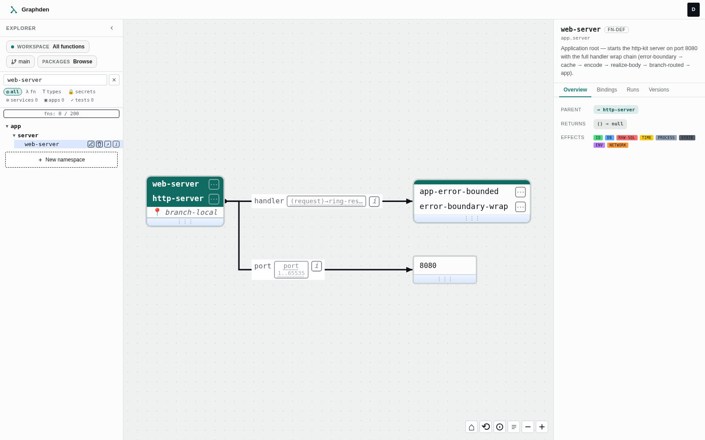

# Graphden

[](https://github.com/Graphden/graphden/actions/workflows/checks.yml)
[](https://clojure.org/)
[](LICENSE)

**Graphden makes software something your whole team can see — and your
AI can safely change.** It is a functional programming environment where
the program is a typed graph in a database — not text in files — and the
runtime executes that graph directly, hot-reloads it, branches it, and
multi-tenants it.

Functions and their compositions are stored as rows (`fn`, `slot`,
`binding`), edited through a visual graph editor, type-checked and
effect-tracked as you build, and executed by an in-memory compiled
registry that refreshes from the database without a redeploy.



<sub>The editor showing this repo's own application root: `web-server`
is a fn-def over `http-server`, its `handler` slot typed
`(request)→ring-response`, its effect set tracked in the inspector.
[Try it live — no sign-up.](https://app.graphden.dev/?demo=1)</sub>

---

## Why this exists

Text-in-files is a great substrate for humans and a *hostile* one for
everything else. Version control, branching, hot-reload, multi-tenancy,
type/effect analysis, and safe automated editing are all bolted on top of
files with external tooling. Graphden's bet is to make the program a
**typed graph in a database**, so those become properties of the
substrate instead of surrounding machinery:

- **The program is data.** A function is rows, not a string. Every
  composition is structurally valid by construction — whole classes of
  syntax and shape errors are unrepresentable.
- **Versioning, branching, and merge are storage features**, not a
  parallel git checkout. Branch a project, diff it, merge it with
  conflict detection — of the code itself.
- **Types, effects, and secrets are first-class graph metadata.** Every
  slot carries a type; every fn carries its tracked effects
  (`db`/`io`/`network`/`time`/…); values marked `[:secret T]` are tracked
  through the graph and hidden at execution sinks. The editor shows you
  all of it while you build.
- **Hot-reload is native.** Edit a fn and the compiled registry
  delta-recompiles the affected closures — no redeploy.
- **Multi-tenant by construction.** The org is the isolation boundary,
  enforced in storage (RLS) and in the executor shard.

**Why now:** free-form text is a poor target for *machine-authored*
software — a model easily emits structurally- or semantically-invalid
code. A typed, effect-annotated, structurally-constrained graph is a
better target, because the structure itself is the guardrail. And as
models write more code while humans read less of it, *reviewing* a change
starts to matter more than writing it. The wager: a typed,
effect-annotated **graph diff is easier to review than a text diff** —
stated plainly as a bet the project now has to test in the market, not a
proven fact.

**Who it's for — three tiers, and AI as one of them.** The substrate
stratifies into roles that compose over the same graph: **package
authors** (experts) write the base-fn impls and typed `fns.edn` that
wrap an integration — Telegram, Google Sheets, Postgres — designing
narrow types and a clean public surface; **composers** (semi-technical)
install those packages and wire them by *type-matching* without reading
the impls; and **end-user surfaces** turn a graph's free arguments into
an embeddable form. The composer tier is exactly the task an LLM does
well — type-guided composition over a constrained, labelled block set —
so an AI can plausibly stand in for it while a human reviews the
resulting graph diff. See
[PHILOSOPHY § The three-tier ecosystem](docs/PHILOSOPHY.md#the-three-tier-ecosystem).

**Why this isn't the visual-programming graveyard:** Scratch and its
lineage failed trying to render `if`/`for`/`while` as blocks — a forced
visual metaphor bolted onto a fundamentally textual, imperative structure.
Graphden instead visualizes a **homoiconic, composition-first substrate —
Lisp, which is already close to an AST** — so the graph *is* the natural
shape of the program, not a costume on top of it. And unlike read-only
"see your code as a graph" viewers, the graph here is the thing you
**edit, diff, and merge**: authorship and review share one surface.

**What this is not:** a claim that visual programming beats text for all
work. It's a bet on a specific niche — internal tools, low-ops backends,
and multi-tenant SaaS where branch-per-tenant, hot-reload, and
effect-gating *are* the product. It's an experimental platform, not a
finished one; see [ROADMAP.md](docs/ROADMAP.md) for what's shipped vs
planned, and [FAQ.md](docs/FAQ.md) for the sharp objections and their
honest answers.

---

## Example: a web server as pure data

Graphden separates **base functions** (small Clojure primitives, each
wrapping ~one library call) from **fn-defs** (pure-data compositions of
them). A running HTTP server is just a composition:

```clojure
;; fn-defs are pure data — no Clojure code
(def fn-defs
  [;; Constant handler: (fn [_] response)
   {:name :hello-handler-fn
    :parent :const
    :args {:value {:status 200 :body "Hello from Graphden!"}}}

   ;; Build a route map. :hello-handler-fn is EXECUTED here — assoc's :value
   ;; slot is not :fn-typed, so the executor evaluates the ref.
   {:name :hello-route-data-fn
    :parent :assoc
    :args {:map {}, :key "handler", :value :hello-handler-fn}}

   ;; A router over those routes.
   {:name :router-fn
    :parent :router
    :args {:routes [["/" {:get :hello-route-data-fn}]]}}

   ;; Start the server. :router-fn is PASSED AS A FUNCTION here —
   ;; http-server's :handler slot IS :fn-typed, so the executor hands the
   ;; fn-id over instead of executing it.
   {:name :web-server-fn
    :parent :http-server
    :args {:handler :router-fn
           :port 8080}}])
```

One concept — the **slot's type** — drives both the editor's type chip
and the runtime dispatch: `:fn`-typed slots receive the fn-id (a
higher-order callable); every other slot gets the executed result. There
is no name-based special-casing anywhere in the executor.

Full walkthrough: [ARCHITECTURE.md § Composition](docs/ARCHITECTURE.md#part-6-composition-fn-defs).

---

## Quick start

### Run it

The whole stack runs in Docker (Graphden + its Postgres + a tenant
Postgres + OpenBao secrets). Building the image needs the Clojure
toolchain on the host — **Java 21+, Clojure 1.12+,
[Babashka](https://github.com/babashka/babashka), Docker**. One command
builds the uberjar + image and brings the stack up:

```bash
bb rebuild
```

Then open the editor at **<http://localhost:9002>**.

Auth is **off by default** (`AUTH_TOKEN` is empty, so the editor is open
— fine for local evaluation). To require a token, set `AUTH_TOKEN=…` in
`.env` (copy `.env.example`) and `bb rebuild`. Full env-var reference,
the `docker compose` / production options, and the RLS/non-superuser DB
setup are in [DEPLOYMENT.md](docs/DEPLOYMENT.md).

> **Note:** no prebuilt image is published yet, so `docker compose up`
> alone won't stand up a clean clone — the executor image is built from a
> jar that `bb rebuild` (or `clojure -T:build uber && docker build …`,
> see DEPLOYMENT.md) produces first. The `mathx` external package it
> pulls is a public repo, so the build needs no credentials.

### Develop

```bash
bb repl        # REPL with the dev profile
bb test        # Run the test suite (uses testcontainers for Postgres)
bb ci          # Full CI: lint (fail-fast) then unit tests; --since <ref> diff-scopes it (coverage: bb coverage)
bb check       # Clojure linters only (clj-kondo / splint / cljstyle)
bb fix         # Auto-fix Clojure formatting
```

After a backend change, `bb rebuild` then `bb verify` (per-section
frontend/packages/backend hash check against `/version`). Linters mostly
self-install on first run; `npm install` once for the JS/CSS set. See
[DEPLOYMENT.md](docs/DEPLOYMENT.md) for the full toolchain and prereqs.

---

## Architecture at a glance

Three layers, each depending only on the one below:

```
┌────────────────────────────────────────────────────────────┐
│  EXECUTOR      compile graph → in-memory registry of         │
│                closures; execute; type-check; effect-track   │
├────────────────────────────────────────────────────────────┤
│  STORAGE       StorageCRUD / ExecutionGraph / Constraints    │
│                Postgres backend · VersionedStorage decorator │
│                · RemoteStorage (BYO executor over HTTP)      │
├────────────────────────────────────────────────────────────┤
│  DATA SCHEMA   fn / slot / fn-slot / binding /               │
│                binding-list-item · versioned (branch+version)│
└────────────────────────────────────────────────────────────┘
```

Execution is served entirely from the in-memory compiled registry
(~microseconds/node); Postgres is touched at compile/invalidation time
and for durable writes, not on the execution inner loop. See
[ARCHITECTURE.md](docs/ARCHITECTURE.md) and [SCALING.md](docs/SCALING.md).

### Source layout (`src/graphden/`)

| Area | Namespaces |
|------|-----------|
| Executor | `executor/` (compile pipeline, registry, composition), `executor_runtime/` (`-main`) |
| CRUD & API | `crud/` (entities, branches, secrets, type-check, fn-execution) |
| Types | `types/` (subtype/unify/narrow, checker) |
| Schema | `schema/` (protocol, malli, graph, versioned, fields) |
| Storage | `storage/` (protocol, postgres, `remote/` for BYO) |
| Versioning | `versioning/` (storage decorator, merge protection) |
| Platform | `tenancy/`, `auth/`, `services/`, `layout/`, `system/`, `clients/` |
| Packages | `packages/` (loader for `resources/packages/`) |

Base functions and fn-defs live under `resources/packages/{pkg}/{module}/`
as `fns.edn` (declarations) + `impls.clj` (Clojure impls); dependencies in
`package.edn` drive load order. See [PACKAGES.md](docs/PACKAGES.md).

---

## Documentation

Start with the **[documentation index](docs/README.md)** — a reader-oriented
map (evaluate → learn → operate → reference). Contributors working *on* the
codebase can also follow the per-topic engineering map in
[CLAUDE.md](CLAUDE.md), which additionally indexes the internal design records.

| Document | For |
|----------|-----|
| [PHILOSOPHY.md](docs/PHILOSOPHY.md) | Design principles and rationale |
| [ARCHITECTURE.md](docs/ARCHITECTURE.md) | Data model, execution model, examples |
| [PACKAGES.md](docs/PACKAGES.md) | Writing base-fns and fn-defs |
| [TYPES.md](docs/TYPES.md) | The type system |
| [VERSIONING.md](docs/VERSIONING.md) | Branches, diff, merge |
| [SCALING.md](docs/SCALING.md) · [DEPLOYMENT.md](docs/DEPLOYMENT.md) | Fleet, ops, deploy |
| [ROADMAP.md](docs/ROADMAP.md) | What's shipped vs planned |
| [tutorial/](docs/tutorial/) | Step-by-step lessons for new users |

---

## Community

- **Website** — [graphden.dev](https://graphden.dev)
- [X / Twitter](https://x.com/graphdendev) · [Bluesky](https://bsky.app/profile/graphden.dev) · [LinkedIn](https://www.linkedin.com/company/graphden) · [YouTube](https://www.youtube.com/@Graphdendev)
- [Discord](https://discord.gg/UDC4pZFvp) · [Telegram](https://t.me/graphden)

---

## License

GNU Affero General Public License v3.0 (AGPL-3.0) — see [LICENSE](LICENSE).
For commercial licensing: licensing@graphden.dev
