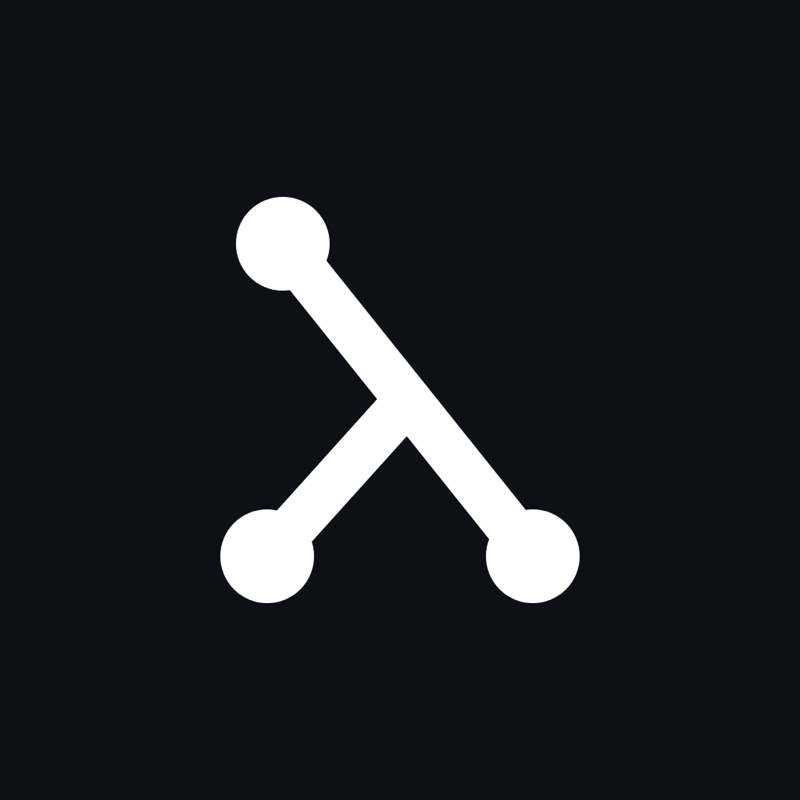
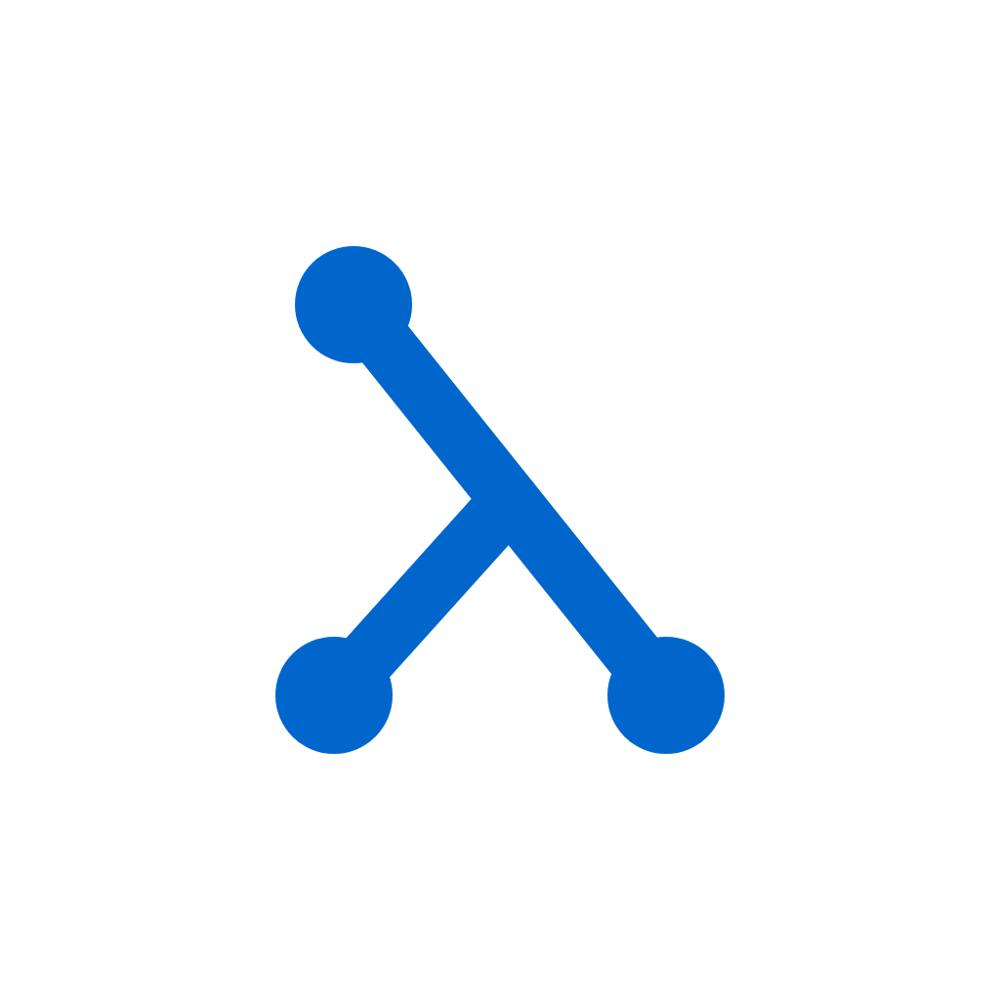
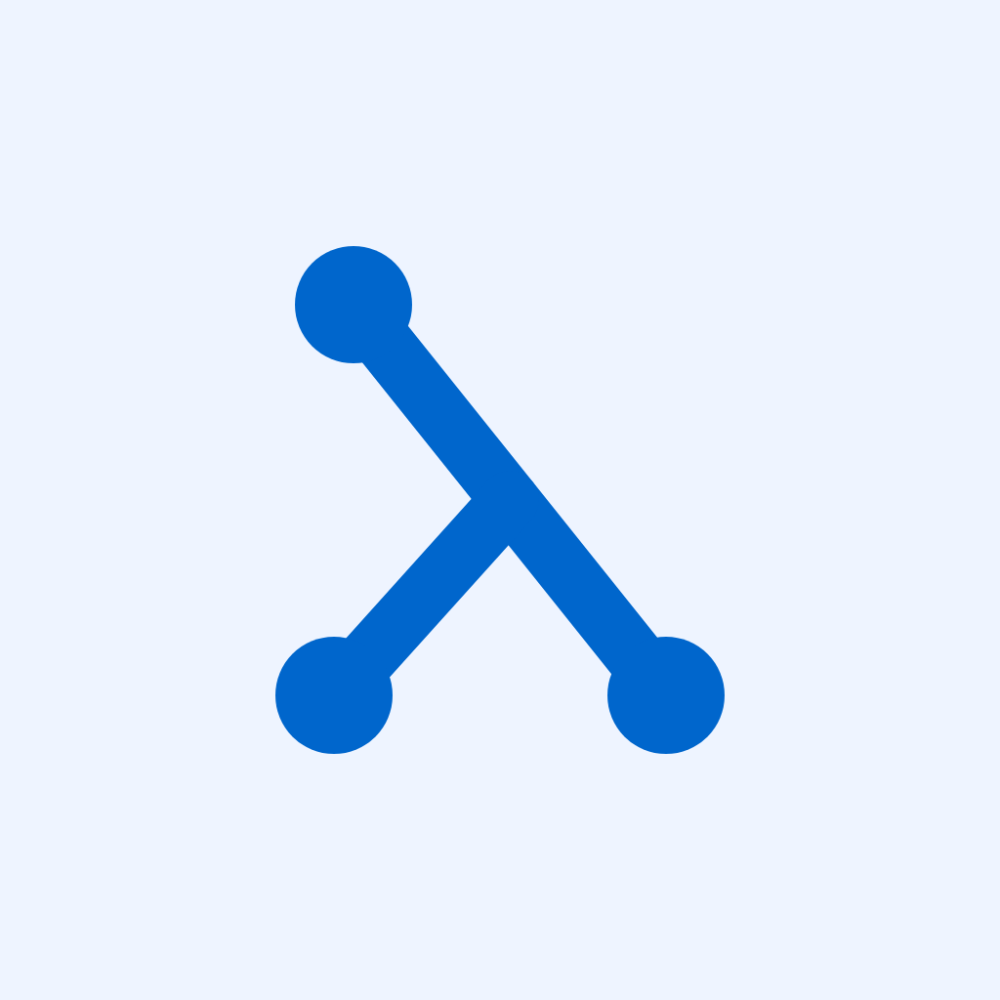

# Graphden Brand

One mark, one palette. This file is the whole visual identity — what the logo
is, its colorways, the color values, and the rules for using them.

Graphden is a visual functional programming environment: code is stored and
edited as a graph. The brand says exactly that in a single glyph.

## The mark


The mark is a lowercase **lambda (λ) built from three graph nodes and two
edges**. It layers two meanings in one shape: functional programming (λ)
drawn in Graphden's own material (nodes and edges).

The geometry is fixed — left-leaning, three **equal** nodes, both feet on the
same baseline. A continuous "spine" runs from the top node down to the right; a
short foot branches down to the left. Nothing in this geometry changes.

```text
viewBox  0 0 32 32   ·   stroke #0066CC   ·   width 3   ·   linecap round
nodes    r3  @ (9,6) (25,26) (8,26)
edges    (9,6)->(25,26)   ·   (17,16)->(8,26)
```

The same mark ships as the application favicon — see `:_favicon-svg-body` in
[`resources/packages/app/editor/fns.edn`](../../resources/packages/app/editor/fns.edn).
`lambda-mark.svg` in this folder is the vector master.

## Colorways

One mark, two inks — brand blue and white. Only the roles swap: the mark color
is chosen for **contrast against the background**; the shape and palette never
change.

| Variant | Preview | Use when |
| --- | --- | --- |
| **Blue** — *primary* |  | Default everywhere it fits: GitHub org, social avatars. Reads best at small sizes. |
| **Gradient** |  | Social profiles and cover images where a little more life helps. |
| **Dark** |  | Dark-themed layouts, dark-mode profiles, dark banners. |
| **Light** |  | Identical to the favicon. Only on a genuinely light background — on plain white it nearly disappears, so prefer Soft. |
| **Soft** |  | A gentle light option for when you need a light ground but pure white is too harsh. |

Pick **one primary colorway per surface** and keep it. The other variants are a
toolkit for context (dark backgrounds, light grounds), not a menu to mix by
mood on a single surface.

## Palette

The whole brand rests on five values. Blue is the only accent; everything else
is background or text.

| Color | Hex | Role |
| --- | --- | --- |
| Graphden Blue | `#0066CC` | Core of the brand — mark, links, accents. |
| Blue Deep | `#0047A3` | Shadow, and the far end of the Gradient variant. |
| Ink | `#0D1117` | Dark ground (Dark variant) and near-black text. |
| Soft Tint | `#EEF4FF` | Light ground (Soft variant). |
| White | `#FFFFFF` | The negative mark and light grounds. |

## Clear space and minimum size

- **Clear space** around the mark is at least the diameter of one node on every
  side.
- **Minimum size** is 16 px (the favicon). Below that the nodes merge into a
  blob.
- **Avatars** keep the mark centered with margin, so it is not clipped by the
  circular crop used on X and GitHub.
- **Do not stretch.** Scale proportionally only; keep a 1:1 aspect ratio.

## Do and don't

**Do**

- Lock one primary colorway to a surface and keep it.
- Choose the variant by background: dark ground uses Dark, light ground uses
  Soft or Light.
- Scale proportionally, preserving the clear space.
- Use Blue as the primary avatar everywhere it fits.

**Don't**

- Recolor the mark outside the palette.
- Change the shape: its lean, node count, node size, or foot baseline.
- Add shadows, outlines, glows, or 3D.
- Place the blue λ on a dark or busy background — low contrast.
- Mix blue-on-white and white-on-blue on the same surface by mood.

## Files

- `lambda-mark.svg` — vector master of the mark (brand blue, transparent).
- `gd-avatar-blue.png` — primary avatar, 1024x1024.
- `gd-avatar-gradient.png` — gradient avatar, 1024x1024.
- `gd-avatar-dark.png` — dark avatar, 1024x1024.
- `gd-avatar-light.png` — light avatar, 1024x1024.
- `gd-avatar-soft.png` — soft avatar, 1024x1024.
